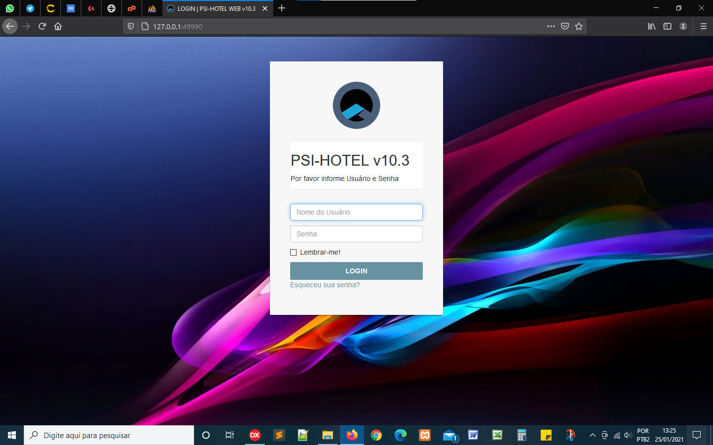
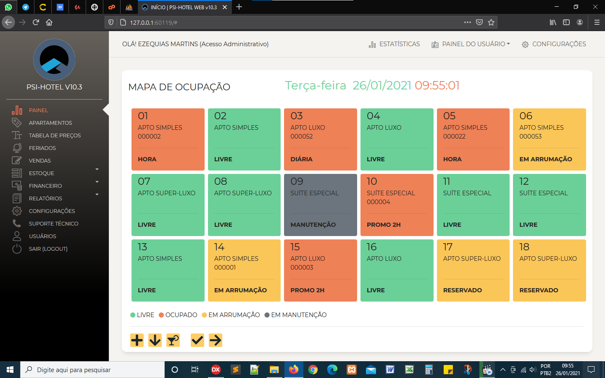
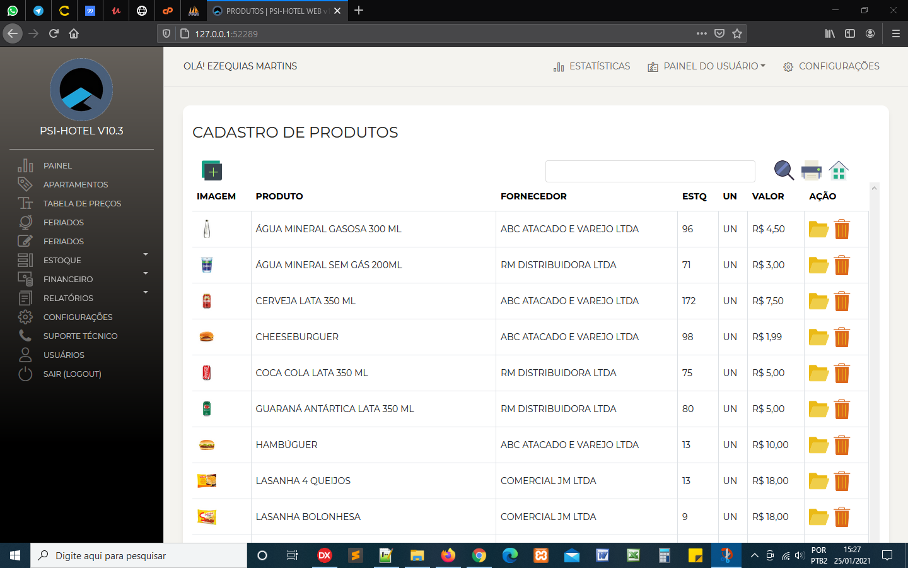
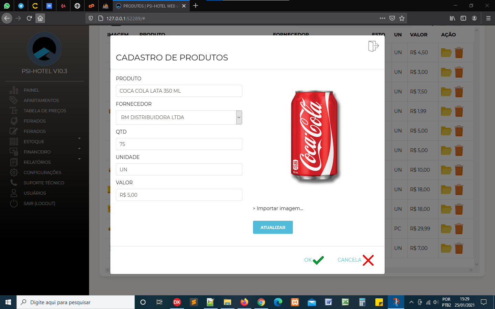
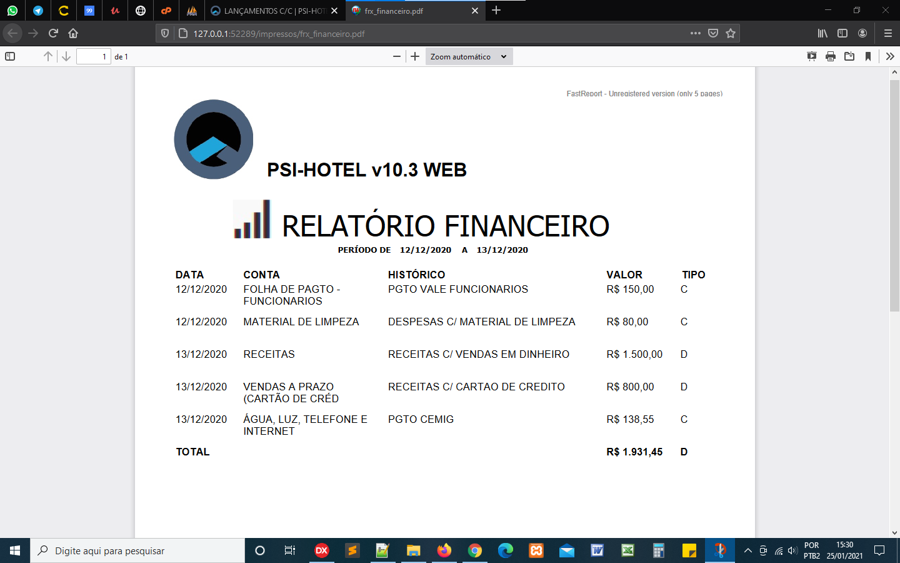

 
## PSI-HOTEL WEB v10.3
Sistema para Hotelaria de Pequeno Porte (Hotéis, Motéis e Pousadas) 
<table>
  <tbody>
    <tr>
      <td></td>
      <td></td>
      <td></td>
    </tr>
    <tr>
      <td></td>
      <td></td>
      <td></td>
    </tr>
  </tbody>
</table>

## Descrição 
Projeto de Desenvolvimento Web c/ Delphi 10.3.3 Community Edition + MySQL usando componentes Intraweb, com integração c/ Bootstrap (HTML5/CSS), Javascript

## Objetivo  
Fornecer por meio de assinatura online, serviços de gestão de hotelaria simplificada e ágil para o segmento de Hotelaria de Pequeno Porte (Hotéis, Motéis e Pousadas), para controle simplifificado de E/S de Hóspedes, Reservas de Hospedagem, Consumação de Serviços (Copa/Cozinha, Armarinho, Lavanderia, Telefonia, etc) integrado com Controle de Estoque e Financeiro, com extensões para uso em mobile (Android/iOS) para controles de Conferência de Copa e Armarinho (Estoque), Lançamento de Pedidos (Comandas), Entregas e Coletas de Rouparia (Lavanderia), etc.

## Histórico 
O projeto original foi desenvolvido a partir de 1999 por Ezequias Martins, inicialmente escrito e compilado na versão 5 do Borland Delphi, utilizando componentes nativos da VCL (Visual Component Library), sendo uma aplicação voltada para uso Desktop e dentro conceito de Programação Orientada a Objetos (POO), tendo sua sua base de dados em DBF e Paradox. Com  o surgimento da versão Borland Delphi 7 em 2002, o projeto foi todo reestruturado, sempre buscando a simplificação e otimização de código e processos. Sua base de dados migranda finalmente para o MySQL desde então. A partir de 2018, com o surgimento do RAD Studio 10 da Embarcadero, foi novamente restruturado na versão 10.3.3 Community Edition e agora está sendo remodelado para o formato Web c/ uso de componentes Intraweb + templates em HTML5/CSS, utilizando o framework Bootstrap e Javascript.

by <a href="https://ezequiasmartins.blogspot.com/" target="_blank">Ezequias Martins</a> ® 1999-2021 Direitos Reservados

